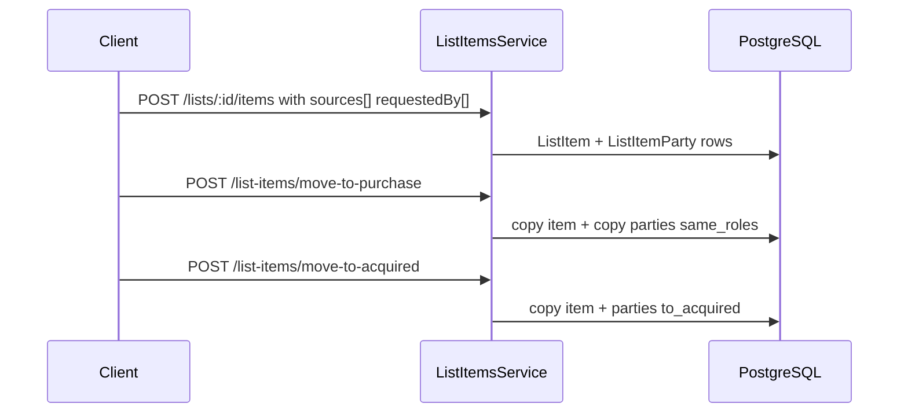

# Inventory & Pricing Management Platform — Project Scope

## Project Overview

IPMP digitizes internal inventory and pricing operations using **workflow lists** and a **product catalog master**. Procurement staff build daily lists, move items forward with full history, and inventory staff verify acquired stock.

This document reflects the **implemented backend** as of June 2026, including the lightweight naming model for sources, requested-by, and stock-owner fields.

---

## Domain Model

```txt
Product (catalog)
    ↓
WorkflowList (PROCUREMENT | PURCHASE | ACQUIRED)
    ↓
ListItem (qty, pricing, status, lineage)
    ├── ListItemParty[] (name + role)
    └── parentItemId → lineage chain
```

### Product

Master data only: `sku`, `name`, `imageUrl`, `categoryId`, `procurementType`, `productDetails`, `description`, `unit`.

No workflow status, quantity, or pricing on the product row.

### ListItem

Workflow context for one product on one list:

- Pricing: `quantity`, `costPrice`, `regularPrice`, `salesPrice`, `minimum20`, `minimum4`, `finalSellingPrice`
- Status: `ACTIVE` | `REMOVED` | `VERIFIED`
- Lineage: `parentItemId` (copy-on-move, never delete upstream rows)
- Parties: multiple names per role (see below)

### ListItemParty (lightweight names)

Unified storage for three business concepts that only need **user-entered names**:

| Role | Meaning | Typical list types |
|------|---------|-------------------|
| `SOURCE` | Who we buy from | All stages |
| `REQUESTED_BY` | Who requested the item | Procurement, purchase |
| `STOCK_OWNER` | Who owns stock after acquisition | Acquired |

```prisma
model ListItemParty {
  id         String
  listItemId String
  name       String    // free text only
  role       PartyRole
  createdAt  DateTime
}
```

**Intentionally not modeled (deferred):**

- Supplier registry, addresses, contacts
- Organization/branch master data
- `sourceId` / `requesterId` selection workflows

**Rationale:** Operations today are name-driven (spreadsheet-style). A single `ListItemParty` table avoids duplicate modules (`Requester`, `StockOwner`, `Source`) while keeping queryable, copyable rows for workflow moves.

### Multiple names per item

One list item may have many sources and many requested-by (or stock-owner) names:

```txt
Cooking Oil
  sources:      ABC Supplier, XYZ Imports
  requestedBy:  Spintex Branch, Wholesale Client
```

Acquired example:

```txt
Basketball Pump
  stockOwner: Main Warehouse, Tema Warehouse, Airport Branch
```

Names are trimmed and deduplicated case-insensitively on write.

---

## Workflow Lifecycle

### Procurement list

Staff create `WorkflowList` (`type: PROCUREMENT`) and add items with optional `sources` and `requestedBy` name arrays.

### Purchase list

`POST /list-items/move-to-purchase` copies items; **all party rows copy with the same roles**. Procurement rows stay unchanged.

### Acquired list

`POST /list-items/move-to-acquired` copies items and:

- Preserves `SOURCE` names
- Sets `STOCK_OWNER` from prior `REQUESTED_BY` names (and any existing `STOCK_OWNER` on the purchase item)

This matches the business rule: “requested by” on early lists becomes “stock owner” after acquisition.

### Rollback

Soft-remove (`REMOVED`) on purchase or acquired items only. Upstream list items remain `ACTIVE`.

### Inventory verification

`InventoryVerification` on acquired `ListItem`s; mismatch statuses notify admins.

---

## Historical Preservation

Moving forward **creates new `ListItem` rows** linked via `parentItemId`. Prior lists retain their items and party names forever.

Example:

| List | Items |
|------|-------|
| Procurement | Pump, Rice, Milk |
| Purchase | Pump, Rice |
| Acquired | Pump |

---

## API Contract

### Create list item

`POST /lists/:listId/items` (procurement lists only)

```json
{
  "productId": "optional-existing",
  "name": "Cooking Oil",
  "categoryId": "...",
  "procurementType": "LOCAL",
  "unit": "L",
  "quantity": 20,
  "costPrice": 10,
  "sources": ["ABC Supplier", "China Vendor"],
  "requestedBy": ["Spintex Branch", "Wholesale Client"]
}
```

### Update list item

`PATCH /list-items/:id`

Any of `sources`, `requestedBy`, `stockOwner` arrays **replaces** that role’s names when sent. Pricing and quantity fields update as before.

### Response

```json
{
  "id": "...",
  "quantity": 20,
  "product": { "name": "Cooking Oil", "sku": "..." },
  "sources": ["ABC Supplier", "XYZ Vendor"],
  "requestedBy": ["Spintex Branch"],
  "stockOwner": []
}
```

Internal `parties` relation is flattened in `formatListItem()` — clients never see raw party row IDs.

### Removed endpoints

- `GET/POST/PATCH /requesters`
- `GET/POST/PATCH /stock-owners`

Use list item payloads instead.

---

## Pricing

`PricingService.calculatePricing(unitCostPrice, quantity)` fills `minimum20` / `minimum4` on list items when `costPrice` is set. Active rates live in `PricingSetting` (seeded defaults: 6% IF, 35% OP, etc.).

`regularPrice`, `salesPrice`, `finalSellingPrice` remain manual commercial fields.

---

## Authorization

| Capability | ADMIN | PROCUREMENT | INVENTORY |
|------------|:-----:|:-----------:|:---------:|
| Lists + items + moves + rollback | ✓ | ✓ | ✗ |
| View acquired lists / items | ✓ | ✓ | ✓ |
| Verify acquired items | ✓ | ✗ | ✓ |
| Categories write | ✓ | ✗ | ✗ |
| Users / audit / pricing admin | ✓ | ✗ | ✗ |

---

## Audit & Notifications

Workflow events log JSON snapshots including `sources` / `requestedBy` / `stockOwner` arrays on list items.

Notification types: `PROCUREMENT_LIST_CREATED`, `ITEM_MOVED_TO_PURCHASE`, `ACQUIRED_LIST_READY`, `VERIFICATION_MISMATCH`, etc.

SSE: `lists.changed`, `list-items.changed`, `verifications.changed`.

---

## Request Flow



---

## Schema & Migrations

- Authoritative: [`backend/prisma/schema.prisma`](backend/prisma/schema.prisma)
- `20260602120000_list_based_procurement`
- `20260603120000_lightweight_list_item_parties` — migrates old `requesters` / `stock_owners` FKs into parties, then drops those tables

---

## Tech Stack

**Backend:** NestJS 11, Prisma 7, PostgreSQL, class-validator  

**Frontend:** Next.js (pending update for list API + party name fields)

---

## Implementation Notes for Future Normalization

When supplier or branch registry is required:

- Introduce optional `externalId` on `ListItemParty` without breaking name-only clients
- Or link parties to master tables while keeping `name` as display snapshot

Current design optimizes for speed of entry and multi-value lists, not master-data governance.
